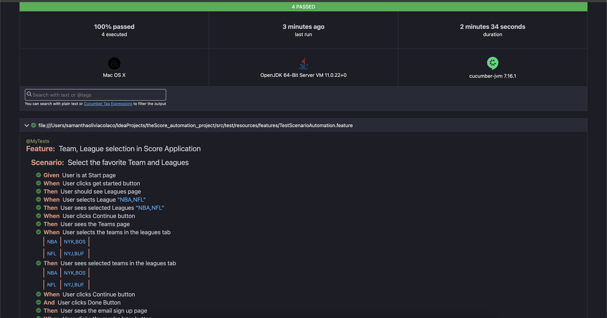

## The Score QA Automation Mobile Challenge
Automate test cases that finds a league, team, or player within theScore app.

------------------------------------------------------

### Description
It is the automation test tool used for TheScore application. This Application is consists of two main frameworks such as Appium and Cucumber. These platforms offer many advantages in this test suite such as, cross-platform compatibility and BDD approach. With the help of appium, it could automate multiple test cases in different devices. For the BDD approach, it integrates cucumber which enables us to write test scenarios in a natural-language that is understandable both in technical and business requirements for this application.

### Tools Used : 
    * Appium 2.0.1
    * JDK 11
    * Node v21.7.2
    * Maven 3.9.6
    * Android-studio
    * Android virtual Device
    * Cucumber

## Steps
    * Clone the repository
    * The test Feature is in resource folder
    * Start virtual device
    * Provide the absolute path of the apk and device name in caps.json. 
    * Provide device name in config.properties
      Optional: Run the appium server at 4723 port. Appium Server is auto started by the code
    * Run command : 
      mvn clean install -Dtest=TestBaseRunner
    * After the successful run, Cucumber report should get generated in target folder(Note: change the format to 'html' because, it saves has document file)

## Report

